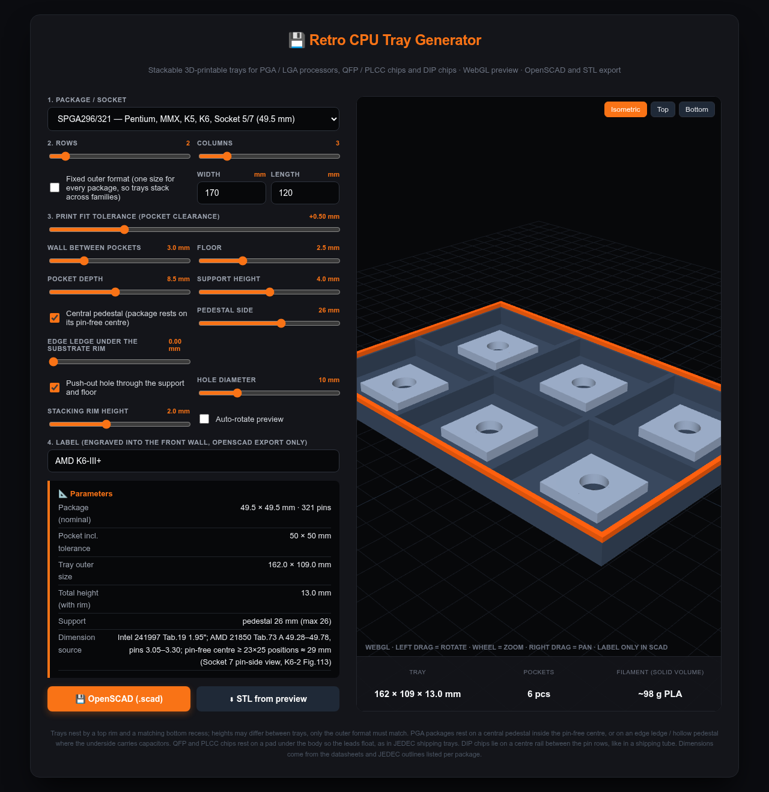

# Chip Tray Generator

A single-file, parametric generator for stackable, 3D-printable storage trays for retro processors and chips:
PGA / LGA CPUs (386 to Athlon 64 / LGA 775), QFP and PLCC chips, and DIP chips in channels.

**Use it online:** https://lopo.github.io/ChipTrayGenerator/ — or download `index.html` and open it locally.
No build, no server; three.js is loaded from a CDN for the preview.

## What it does

- Pick a package, set rows × columns, walls, floor, pocket depth and print tolerance.
- Live WebGL preview (rotate / zoom / pan, isometric, top and bottom views).
- **OpenSCAD export** (`.scad`, fully parametric, exact geometry) plus **STL** and **3MF** straight from the preview. 3MF carries its unit, so it can never be imported at the wrong scale, and is several times smaller than the STL (welded vertices + deflate; written without any library).
- **Stacking:** every tray has a 2 mm rim on top and a matching recess underneath, so trays nest.
  Tray heights may differ; only the outer size must match. Turn on **Fixed outer format** to give trays for different
  packages the same footprint — pockets are centred and the leftover goes into the outer wall. "Max pockets that fit"
  fills the format.

## How the chips are held

| Family | Support | Why |
|---|---|---|
| Ceramic PGA (386, 486, Pentium, K6, Athlon) | central pedestal inside the pin-free centre, push-out hole | pins hang free, nothing touches them |
| FC-PGA 370 | edge ledge under the substrate rim, or a hollow pedestal | Intel puts capacitors on the underside inside a 17.78 mm square |
| Socket 423 / 478 / 604 / 754 / 939 / AM2 / AM3 / LGA | edge ledge only | underside is covered by capacitors or lands |
| QFP / PLCC | pad under the plastic body, leads float | same principle as JEDEC shipping trays |
| DIP | centre rail between the pin rows, chips end to end in a channel | same principle as a shipping tube |

The generator warns when a support would touch pins, capacitors or lead feet.

## Where the numbers come from

Package sizes and pin-free centres are taken from manufacturer datasheets, not guessed:

| Package | Source |
|---|---|
| PGA68 (287/387) | 11×11 @ 2.54 mm; Kyocera C-PGA 27.94 sq, MIL-STD-1835 CMGA3-P68C 28.96–29.97 mm |
| PGA132 (386DX) | Intel 386DX datasheet 231630, Fig. 8.1: 1.450 in = 36.802 mm square, 14×14 @ 2.54 mm, 3 rows |
| PGA168 (486) | Intel packaging databook, 1.75 in = 44.19–45.21 mm |
| SPGA296/321 (Socket 5/7) | Intel Pentium datasheet 241997 Tab. 19; Intel AP-579 Socket 7 pin-side view; AMD K6-2 datasheet 21850 Tab. 73 / Fig. 113 |
| PPGA / FC-PGA 370 | Intel Pentium III PGA370 datasheet 245264 Tab. 35 / Fig. 23, 31 |
| Socket A 462 | AMD Athlon XP Model 8 datasheet 25175 Tab. 21 / Fig. 14, 17 |
| Socket 423, 478, 604, 754/939/940, AM2/AM3, LGA 775 | Intel / AMD published package sizes; underside treated as populated |
| QFP / PLCC | JEDEC MS-022, MS-026, MS-018, MS-016, MO-069 |
| DIP | JEDEC MS-001 (0.3"), MS-011 (0.6"), MO-016 class (0.9") — maximum body lengths |

Pedestal sizes for the older PGAs were read off the pinout drawings (pin-free centre minus one pin diameter of margin).
The mobile / late-desktop entries use conservative defaults because their substrate rim is narrow; keep the tolerance
at 0.3 mm or less there, as the tool tells you.

## Printing notes

- Pocket sizes take the **largest** published package dimension, so every specimen fits; the tolerance is added on top. Default is +0.5 mm per pocket; measure one printed pocket and adjust.
- Every pocket has a push-out hole (one per chip in a DIP channel) so a single chip can be lifted out of a full tray. Its mouth on the underside — the end you actually poke — is funnelled at 45°, so there is no sharp rim and it is easier to find blind. The diameter is a slider, up to 30 mm.
- Optional **finger notches**: the walls between pockets are slotted from the top down to the level the chip rests on, on both axes, so a chip can also be picked out sideways.
- The label is real geometry in both styles. **Raised** comes out of the 3MF as a **second object with its own material**, so a dual-colour printer can put it on another extruder; a single filament prints the same part. **Engraved** is cut into the front wall and exports in the STL and 3MF as well — it is built without any CSG library, by leaving the wall open over the label patch and putting back a plate shaped "patch minus glyphs", with the counters of letters like O and A as their own small solids.
- The underside is stepped in by `rim_w + tol/2` over the bottom `rim_h + 0.3` mm — that is the part that drops inside the rim of the tray below. Going back to full width leaves a 90° ledge, which you can either keep (**square step**, print it with support) or have chamfered away over the next few millimetres (**45° chamfer**, the default, prints without support). Both nest identically: the chamfer sits above the rim, so it never touches it.
- The label sits on the part of the front wall that is at full width, above the underside step, and is shrunk to fit if that band is short. It is **remembered per package** in the browser, because one outline covers several sockets and CPU families (LGA775 and LGA771, AM2 through AM3+ and FM, PGA168 from the 486 to a 5x86) so no default text could be right — but what you typed last time can come back. The tool warns when the outer wall gets thin where it meets the floor — raising the floor to the top of the chamfer removes the thinning completely.
- Supports are 4 mm high for PGA (pin length is 3.05–3.30 mm), 1.5 mm for QFP/PLCC, 4 mm for DIP.
- The OpenSCAD export is a clean manifold. The STL and 3MF are a union of overlapping solids, which slicers
  accept, but use the SCAD output when you want to edit anything. Every exported surface is closed: the build
  is checked so that no edge belongs to an odd number of triangles, over every package, format and option.
  Shapes carrying several holes are avoided for that reason — three.js bridges them in a way that leaves the
  cap open, which showed up in Bambu Studio as push-out holes that did not go through.
- Verified on printed trays so far: PGA168 (486) 5×3 on a Bambu Lab. If you print another one, please report the measured pocket width, whether the chip clears the floor, and whether two trays nest.

## License

MIT — see `LICENSE`. three.js (MIT) is loaded from cdnjs / jsDelivr at runtime.
